# Security Control Plane

[](https://github.com/idir-oai/security-control-plane/actions/workflows/sensitive-log-review.yml)

Repositorio central para aplicar una revision de datos sensibles en logs a multiples repositorios mediante GitHub organization rulesets y Codex.

El workflow se define una sola vez en:

```text
.github/workflows/sensitive-log-review.yml
```

Los repositorios consumidores no necesitan un caller YAML ni un reusable workflow con `workflow_call`. GitHub selecciona este fichero directamente desde el ruleset de la organizacion.

## Flujo

```mermaid
flowchart LR
    PR[Pull request en repositorio objetivo] --> RULESET[Organization ruleset]
    SOURCE[security-control-plane<br/>sensitive-log-review.yml] --> RULESET
    RULESET --> RUN[GitHub Actions]
    RUN --> TARGET[Checkout del PR en target/]
    RUN --> CONTROL[Checkout del control plane<br/>en el SHA del workflow]
    TARGET --> SCAN[Semgrep estatico]
    CONTROL --> SCAN
    SCAN --> DECISION{Candidatos}
    DECISION -->|Ninguno| PASS[Check pass sin usar API]
    DECISION -->|Existen| ISOLATE[Eliminar instrucciones y config<br/>controladas por el target]
    ISOLATE --> CODEX[Codex read-only]
    CODEX --> ENFORCE[Enforcement estructurado]
    ENFORCE --> GATE{Required workflow}
    PASS --> GATE
    GATE -->|Pass| MERGE[Merge permitido]
    GATE -->|Fail o pending| BLOCK[Merge bloqueado]
```



## Contenido

- `.github/workflows/sensitive-log-review.yml`: workflow que se selecciona desde el organization ruleset.
- `.semgrep/sensitive-logging.yml`: generacion determinista y deliberadamente amplia de candidatos.
- `policies/security-logging-policy.md`: politica central y autoritativa.
- `scripts/build-review-prompt.mjs`: limita el diff a los ficheros candidatos y construye el contexto no confiable.
- `scripts/prepare-review-workspace.mjs`: retira del checkout efimero instrucciones y configuracion de Codex controladas por el target.
- `scripts/enforce-review.mjs`: convierte el veredicto estructurado en el resultado bloqueante.
- `schemas/codex-review.schema.json`: contrato JSON del resultado de Codex.
- `docs/organization-setup.md`: pasos para activar el workflow en una organizacion.

## Limites de seguridad

- El workflow no ejecuta tests, scripts, gestores de paquetes ni codigo del repositorio objetivo.
- La API key solo se entrega a `openai/codex-action`; no se define como variable global del job.
- Codex se ejecuta con sandbox de solo lectura y `drop-sudo`.
- Los ficheros `AGENTS.md`, `AGENTS.override.md`, directorios `.codex` y metadatos `.git` del target se eliminan del checkout efimero antes de ejecutar Codex.
- Los comentarios, strings y documentacion del target siguen siendo contenido no confiable y el prompt obliga a tratarlos exclusivamente como evidencia.
- Si Semgrep no genera candidatos, el check termina correctamente sin consumir API ni necesitar `OPENAI_API_KEY`.

## Credencial

El workflow espera `OPENAI_API_KEY` como organization secret, limitado a los repositorios objetivo. Debe ser una project API key estandar. Una employee key restringida a la red corporativa devolvera `employee_api_key_requires_corporate_network` en un runner hospedado por GitHub.

No se almacena ninguna credencial en este repositorio.

## Estado de esta demo

El repositorio esta alojado inicialmente bajo la cuenta personal `idir-oai`. El fichero central queda preparado, pero una cuenta personal no puede aplicar un organization ruleset a otros repositorios. Para activar la obligacion centralizada hay que transferir este repositorio y los repositorios objetivo a una GitHub Organization con acceso a la regla **Require workflows to pass before merging**.

Consulta [la configuracion de la organizacion](docs/organization-setup.md) y [la arquitectura detallada](docs/architecture.md).
