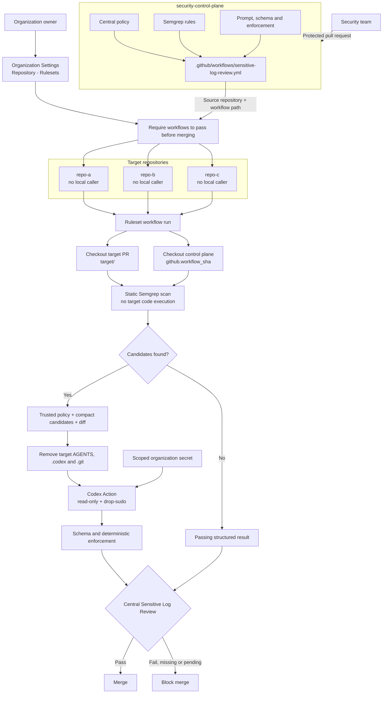

# Centralized architecture

## Trust boundaries

1. The control-plane commit identified by `github.workflow_sha` is trusted.
2. The target checkout, its diff, source, comments, documentation, and configuration are untrusted evidence.
3. Semgrep and the prompt builder run before any credential is provided.
4. No target-controlled command runs in the credential-bearing job.
5. Only `openai/codex-action` receives the API key, and Codex runs last among steps that can access it.
6. Deterministic enforcement validates the structured decision and fails on `block` or `needs-review`.
